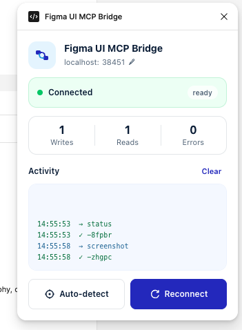

# Figma UI MCP Bridge

## Kiettt8 Custom Edition

Figma UI MCP Bridge là cầu nối giữa một MCP client và Figma Desktop.
MCP client có thể đọc cấu trúc thiết kế, chụp màn hình, tạo node và
chỉnh sửa giao diện trực tiếp trên Figma canvas.

Repository này là một bản phát triển độc lập dựa trên
[TranHoaiHung/figma-ui-mcp][upstream]. Phần MCP server và plugin nền tảng
thuộc dự án gốc. Giao diện plugin và tài liệu cài đặt trong repository này
được tùy chỉnh bởi Kiettt8.

License: MIT. Xem chi tiết tại [LICENSE](LICENSE).



---

## 1. Thông tin triển khai

| Hạng mục | Giá trị |
| --- | --- |
| Repository | `https://github.com/kiettt8-product/figma-ui-mcp` |
| Phiên bản nền tảng | `2.5.26` |
| Node.js | Từ phiên bản 18 |
| Figma | Figma Desktop |
| Bridge mặc định | Port `38451` |
| Phạm vi sử dụng | Local development |
| API key Figma | Không yêu cầu |

## 2. Mục tiêu

Sau khi hoàn tất tài liệu này, bạn có thể:

1. Chạy MCP server từ source code của repository.
2. Kết nối Codex, Claude Desktop, Cursor hoặc MCP client khác với server.
3. Đăng ký plugin development trong Figma Desktop.
4. Kiểm tra kết nối bằng `figma_status`.
5. Phát triển giao diện plugin trong `plugin/ui.html`.
6. Build lại plugin khi thay đổi logic trong `src/plugin`.

## 3. Cách hệ thống hoạt động

```text
MCP client
    |
    | MCP qua stdio
    v
Node.js MCP server
    |
    | HTTP long polling trên port 38451
    v
Figma development plugin
    |
    | Figma Plugin API
    v
Figma document
```

MCP client tự khởi chạy `server/index.js`. MCP server tiếp nhận lệnh từ AI
và chuyển lệnh đến plugin đang mở trong Figma Desktop. Plugin thực thi lệnh
trên Figma document rồi trả kết quả về MCP client.

Figma bản web không phù hợp với cấu hình này vì bridge chạy trên máy local.
Hãy sử dụng Figma Desktop.

## 4. Các công cụ MCP chính

| Công cụ | Mục đích |
| --- | --- |
| `figma_status` | Kiểm tra server, plugin và Figma session đang kết nối |
| `figma_docs` | Đọc tài liệu API và ví dụ thao tác |
| `figma_write` | Tạo hoặc chỉnh sửa node trên Figma canvas |
| `figma_read` | Đọc node, selection, style, screenshot hoặc SVG |
| `figma_rules` | Tổng hợp token, typography, variable và component |

Khi bắt đầu một phiên làm việc, nên gọi `figma_status` trước. Nếu cần tạo
hoặc chỉnh sửa thiết kế, đọc `figma_docs` trước khi gọi `figma_write`.

---

## 5. Cài đặt từ đầu

### Bước 1. Kiểm tra môi trường

Mở Terminal và chạy:

```bash
node --version
npm --version
git --version
```

Yêu cầu:

- Node.js từ phiên bản 18.
- npm đi kèm Node.js.
- Git.
- Figma Desktop.
- Một MCP client như Codex, Claude Desktop, Cursor, VS Code hoặc Windsurf.

### Bước 2. Clone repository

Chọn một thư mục cố định. Không nên đặt source trong thư mục tạm vì Figma
lưu chính xác đường dẫn đến file manifest.

```bash
git clone https://github.com/kiettt8-product/figma-ui-mcp.git
cd figma-ui-mcp
npm install
```

### Bước 3. Lấy đường dẫn tuyệt đối

Trên macOS hoặc Linux:

```bash
pwd
```

Trên Windows PowerShell:

```powershell
(Get-Location).Path
```

Ví dụ:

```text
/Users/your-name/Projects/figma-ui-mcp
```

Đường dẫn này được sử dụng trong cấu hình MCP client.

### Bước 4. Kiểm tra server

```bash
node server/cli.js --version
```

Kết quả cần hiển thị phiên bản của `figma-ui-mcp`.

---

## 6. Cấu hình MCP client

Chỉ cấu hình một trong các phương án bên dưới. Luôn dùng đường dẫn tuyệt đối
đến `server/index.js`.

### 6.1. Codex

Mở file:

```text
~/.codex/config.toml
```

Thêm cấu hình:

```toml
[mcp_servers.figma-ui-mcp]
command = "node"
args = ["/ABSOLUTE/PATH/TO/figma-ui-mcp/server/index.js"]
```

Ví dụ trên macOS:

```toml
[mcp_servers.figma-ui-mcp]
command = "node"
args = ["/Users/your-name/Projects/figma-ui-mcp/server/index.js"]
```

Lưu file, thoát hoàn toàn Codex rồi mở lại.

### 6.2. Claude Code

Chạy:

```bash
claude mcp add --scope user figma-ui-mcp -- node /ABSOLUTE/PATH/TO/figma-ui-mcp/server/index.js
```

Kiểm tra:

```bash
claude mcp list
```

Sau đó thoát và mở lại Claude Code.

### 6.3. Claude Desktop, Cursor hoặc Windsurf

Thêm server vào phần `mcpServers` trong file cấu hình của client:

```json
{
  "mcpServers": {
    "figma-ui-mcp": {
      "command": "node",
      "args": [
        "/ABSOLUTE/PATH/TO/figma-ui-mcp/server/index.js"
      ]
    }
  }
}
```

Các vị trí cấu hình thường dùng:

- Claude Desktop trên macOS:
  `~/Library/Application Support/Claude/claude_desktop_config.json`
- Claude Desktop trên Windows:
  `%APPDATA%\Claude\claude_desktop_config.json`
- Cursor theo project: `.cursor/mcp.json`
- Cursor toàn máy: `~/.cursor/mcp.json`
- Windsurf: `~/.codeium/windsurf/mcp_config.json`

Lưu file, thoát hoàn toàn client rồi mở lại.

### 6.4. VS Code

Tạo hoặc cập nhật `.vscode/mcp.json`:

```json
{
  "servers": {
    "figma-ui-mcp": {
      "type": "stdio",
      "command": "node",
      "args": [
        "/ABSOLUTE/PATH/TO/figma-ui-mcp/server/index.js"
      ]
    }
  }
}
```

Khởi động lại VS Code sau khi lưu cấu hình.

### Kết quả mong đợi

Sau khi MCP client khởi động lại:

1. Client nhận diện server `figma-ui-mcp`.
2. Tiến trình Node.js chạy `server/index.js`.
3. Bridge mở port `38451` hoặc một port dự phòng trong dải tiếp theo.
4. `figma_status` có thể được gọi, dù plugin có thể chưa kết nối ở bước này.

---

## 7. Đăng ký plugin trong Figma Desktop

### Bước 1. Mở phần quản lý plugin development

Trong Figma Desktop, vào:

```text
Plugins > Development > Manage plugins in development
```

### Bước 2. Xóa đăng ký cũ nếu có

Nếu đã từng cài một bản Figma UI MCP Bridge khác:

1. Tìm plugin cũ trong danh sách development.
2. Kiểm tra đường dẫn manifest.
3. Xóa đăng ký cũ nếu đường dẫn trỏ đến Downloads, npm cache hoặc một
   repository khác.

Thao tác này chỉ xóa đăng ký development, không xóa source code.

### Bước 3. Import manifest

Chọn `Import plugin from manifest`, sau đó mở:

```text
/ABSOLUTE/PATH/TO/figma-ui-mcp/plugin/manifest.json
```

Tên plugin hiển thị:

```text
Figma UI MCP Bridge · Kiettt8
```

### Bước 4. Chạy plugin

1. Mở một Figma design file.
2. Vào `Plugins > Development`.
3. Chạy `Figma UI MCP Bridge · Kiettt8`.
4. Giữ cửa sổ plugin mở trong lúc sử dụng MCP.

Plugin mở trực tiếp bằng giao diện sáng mới trong hình ở đầu README. Giao
diện tối của dự án gốc không còn là giao diện mặc định trong repository này.
Khi bridge hoạt động, trạng thái chuyển từ `Connecting` sang `Connected`.

Không cần chạy thêm `npx figma-ui-mcp` trong Terminal nếu MCP client đã được
cấu hình theo mục 6. MCP client sẽ tự khởi chạy `server/index.js`.

---

## 8. Kiểm tra kết nối

Trong MCP client, yêu cầu gọi:

```text
figma_status
```

Kết nối thành công cần có:

| Trường kiểm tra | Kết quả |
| --- | --- |
| Server | Đang chạy |
| Plugin | `pluginConnected: true` |
| Port | `38451` hoặc port dự phòng |
| Session | Có Figma file đang mở |
| File name | Trùng với file đang mở trong Figma |

Nếu `pluginConnected` là `false`, kiểm tra theo thứ tự:

1. Figma Desktop đang mở.
2. Development plugin đang chạy.
3. MCP client đã được khởi động lại sau khi sửa cấu hình.
4. Đường dẫn `server/index.js` là đường dẫn tuyệt đối và tồn tại.
5. Không có tiến trình cũ chiếm port bridge.

---

## 9. Thử thao tác đầu tiên

Yêu cầu AI kiểm tra trạng thái:

```text
Kiểm tra kết nối Figma bằng figma_status.
```

Sau khi kết nối thành công:

```text
Đọc selection hiện tại trong Figma và mô tả cấu trúc layout.
```

Ví dụ tạo giao diện:

```text
Đọc figma_docs, sau đó tạo một mobile frame 390 x 844 gồm tiêu đề,
hai input và một primary button. Chụp screenshot để kiểm tra kết quả.
```

Quy trình nên sử dụng:

1. Gọi `figma_status`.
2. Gọi `figma_docs` nếu cần viết hoặc sửa thiết kế.
3. Gọi `figma_read` để hiểu canvas hoặc selection hiện tại.
4. Gọi `figma_write` để thực hiện thay đổi.
5. Gọi `figma_read` với screenshot để kiểm tra kết quả.

---

## 10. Phát triển giao diện plugin

File giao diện:

```text
plugin/ui.html
```

Đối với thay đổi HTML, CSS hoặc JavaScript nằm trong file này:

1. Sửa `plugin/ui.html`.
2. Đóng cửa sổ plugin đang chạy.
3. Chạy lại development plugin trong Figma.
4. Kiểm tra trạng thái kết nối và giao diện.

Không cần chạy build nếu chỉ sửa `plugin/ui.html`.

Các nguyên tắc giao diện hiện tại:

| Thành phần | Quy ước |
| --- | --- |
| Primary color | `#0033C9` |
| Primary text | `#001F3E` |
| Base surface | `#FFFFFF` |
| Subtle surface | `#F5F9FF` |
| Typography | SF Pro hoặc system font |
| Control height | Khoảng 44 px |
| Corner radius | Khoảng 8 đến 12 px |

---

## 11. Phát triển logic Figma plugin

Source logic nằm trong:

```text
src/plugin/
```

Sau khi thay đổi source:

```bash
npm run build:plugin
```

Lệnh này tạo lại:

```text
plugin/code.js
```

Không sửa trực tiếp `plugin/code.js` vì đây là file được sinh tự động.

Để tự động build lại khi source thay đổi:

```bash
npm run dev
```

Sau mỗi lần build:

1. Đóng plugin đang chạy.
2. Chạy lại development plugin.
3. Kiểm tra chức năng vừa thay đổi.

---

## 12. Phát triển MCP server

Source MCP server nằm trong:

```text
server/
```

Các file chính:

| File | Trách nhiệm |
| --- | --- |
| `server/index.js` | MCP server và stdio transport |
| `server/bridge-server.js` | HTTP bridge và quản lý session |
| `server/tool-definitions.js` | Định nghĩa MCP tools |
| `server/code-executor.js` | Thực thi thao tác đã được kiểm soát |
| `server/api-docs.js` | Nội dung trả về từ `figma_docs` |

Sau khi sửa server:

1. Thoát hoàn toàn MCP client.
2. Kiểm tra tiến trình Node.js cũ đã dừng.
3. Mở lại MCP client để server mới được khởi chạy.
4. Chạy lại Figma plugin.
5. Gọi `figma_status`.

Chạy server thủ công chỉ nên dùng để kiểm tra:

```bash
npm start
```

Trong sử dụng bình thường, MCP client sẽ tự khởi chạy server.

---

## 13. Xử lý lỗi

### 13.1. Vẫn thấy giao diện cũ

Nguyên nhân thường gặp là Figma đang dùng một manifest khác, một bản plugin
đã giải nén từ `plugin.zip` cũ, hoặc package npm của dự án gốc.

Cách xử lý:

1. Trong repository, chạy `git pull origin main`.
2. Mở `Manage plugins in development`.
3. Xóa tất cả đăng ký Figma UI MCP Bridge cũ.
4. Import đúng `plugin/manifest.json` từ repository vừa pull.
5. Đóng popup plugin và chạy lại plugin.
6. Nếu vẫn chưa cập nhật, thoát hoàn toàn Figma Desktop rồi mở lại.

File nguồn chuẩn của giao diện là `plugin/ui.html`. File `plugin.zip` trong
repository cũng được đóng gói từ cùng thư mục `plugin/`, nhưng development
plugin nên luôn import trực tiếp `plugin/manifest.json` để nhận thay đổi mới.

### 13.2. MCP client đang chạy bản npm thay vì source local

Không sử dụng cấu hình sau cho bản custom:

```json
{
  "command": "npx",
  "args": ["figma-ui-mcp"]
}
```

Cấu hình trên tải package npm của dự án gốc. Hãy thay bằng:

```json
{
  "command": "node",
  "args": [
    "/ABSOLUTE/PATH/TO/figma-ui-mcp/server/index.js"
  ]
}
```

### 13.3. Port 38451 đang được sử dụng

Trên macOS hoặc Linux:

```bash
lsof -nP -iTCP:38451 -sTCP:LISTEN
```

Trên Windows:

```powershell
netstat -ano | findstr :38451
```

Xác định tiến trình trước khi dừng. Thông thường chỉ cần thoát MCP client cũ
rồi mở lại.

### 13.4. Plugin ở trạng thái Connecting

Kiểm tra:

1. MCP client đã nhận server hay chưa.
2. `server/index.js` có chạy hay không.
3. Port trong plugin có trùng port server hay không.
4. Firewall có chặn kết nối local hay không.
5. Figma đang chạy đúng development plugin hay không.

### 13.5. Lệnh chạy vào nhầm Figma file

Bridge hỗ trợ nhiều session. Nếu đang mở plugin trong nhiều Figma file:

1. Gọi `figma_status` để xem danh sách session.
2. Đóng những plugin instance không sử dụng.
3. Hoặc truyền đúng `sessionId` khi gọi `figma_read` và `figma_write`.

---

## 14. Kiểm tra trước khi bàn giao

Một cấu hình hoàn chỉnh cần đạt các điều kiện sau:

1. `npm install` chạy thành công.
2. MCP client dùng đường dẫn local đến `server/index.js`.
3. Figma Desktop đăng ký đúng `plugin/manifest.json`.
4. Plugin hiển thị tên `Figma UI MCP Bridge · Kiettt8`.
5. Plugin hiển thị giao diện sáng mới, không phải giao diện tối cũ.
6. `figma_status` trả về `pluginConnected: true`.
7. `figma_read` đọc được selection hoặc page.
8. `figma_write` tạo được một node thử nghiệm.
9. Screenshot trả về đúng frame vừa thao tác.

---

## 15. Cấu trúc repository

```text
figma-ui-mcp/
|-- plugin/
|   |-- manifest.json
|   |-- ui.html
|   `-- code.js
|-- src/
|   `-- plugin/
|-- server/
|   |-- index.js
|   |-- bridge-server.js
|   |-- tool-definitions.js
|   |-- code-executor.js
|   `-- api-docs.js
|-- scripts/
|   `-- build-plugin.js
|-- package.json
|-- CHANGELOG.md
|-- LICENSE
`-- README.md
```

---

## 16. Lưu ý bảo mật

Bridge này được thiết kế cho local development.

1. Không expose trực tiếp port `38451` lên Internet.
2. Bridge không có cơ chế authentication phù hợp cho môi trường production.
3. Không chạy trên mạng không tin cậy nếu chưa giới hạn network binding và firewall.
4. Kiểm tra các thao tác do AI tạo trước khi áp dụng lên design file quan trọng.
5. Không lưu credential hoặc dữ liệu nhạy cảm trong prompt, source code hoặc
   Figma plugin.

---

## 17. Cập nhật từ dự án gốc

Repository này độc lập với dự án gốc và không thuộc fork network. Có thể
thêm remote chỉ để theo dõi thay đổi:

```bash
git remote add upstream https://github.com/TranHoaiHung/figma-ui-mcp.git
git fetch upstream
```

Do repository này sử dụng lịch sử độc lập, không merge trực tiếp
`upstream/main` vào `main` nếu chưa kiểm tra. Quy trình an toàn:

1. Tạo một branch thử nghiệm.
2. So sánh source hiện tại với phiên bản upstream cần cập nhật.
3. Chọn từng thay đổi cần thiết.
4. Giữ lại `plugin/ui.html`, `plugin/manifest.json` và tài liệu custom.
5. Build và kiểm tra lại plugin.
6. Chỉ merge branch thử nghiệm sau khi `figma_status`, `figma_read` và
   `figma_write` hoạt động.

---

## 18. Nguồn và ghi nhận

| Phạm vi | Tác giả |
| --- | --- |
| Dự án gốc | [TranHoaiHung/figma-ui-mcp][upstream] |
| Custom plugin UI | Kiettt8 |
| Tài liệu cài đặt và phát triển | Kiettt8 |
| License | MIT |

Repository này giữ ghi nhận dự án gốc theo giấy phép MIT, đồng thời duy trì
lịch sử Git độc lập cho bản Kiettt8 Custom Edition.

[upstream]: https://github.com/TranHoaiHung/figma-ui-mcp
