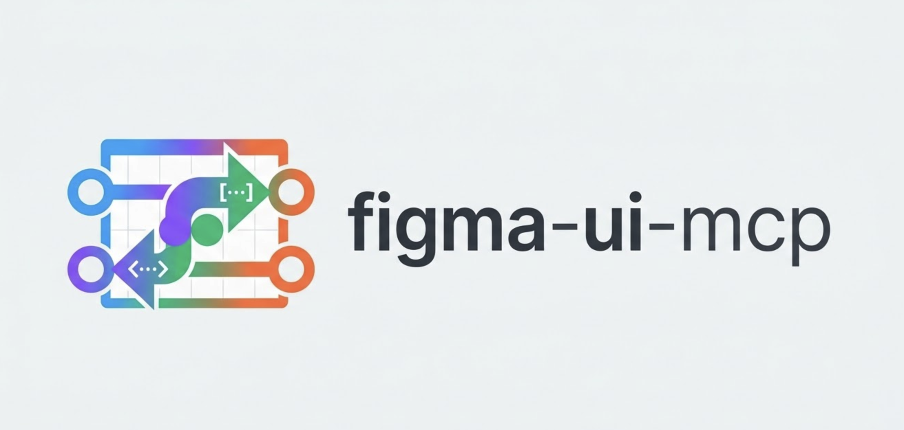

# figma-ui-mcp

> **Kiettt8 Custom Edition** — custom light design-system UI by **Kiettt8**.
> Based on the original MIT-licensed project by [TranHoaiHung](https://github.com/TranHoaiHung/figma-ui-mcp).

📘 **[Step-by-step installation, development, and troubleshooting guide](KIETTT8_SETUP.md)**

<p align="center">
  
</p>

<p align="center">
  <a href="https://www.npmjs.com/package/figma-ui-mcp"></a>
  <a href="https://registry.modelcontextprotocol.io"></a>
  <a href="LICENSE"></a>
  <a href="https://github.com/TranHoaiHung/figma-ui-mcp/stargazers"></a>
</p>

<p align="center">
  <strong>Claude Code to Figma</strong> · <strong>Antigravity to Figma</strong> · <strong>Cursor to Figma</strong> · <strong>Any MCP IDE to Figma</strong>
</p>

<p align="center">
  <sub>✅ Tested: Claude Code, Antigravity &nbsp;|&nbsp; 🔧 Compatible: Cursor, VS Code, Windsurf, Zed (any MCP stdio client)</sub>
</p>

**Bidirectional Figma MCP bridge** — let AI assistants (Claude Code, Cursor, Windsurf, Antigravity, VS Code Copilot, or any MCP-compatible IDE) **draw UI directly on Figma canvas** and **read existing designs back** as structured data, screenshots, or code-ready tokens. No Figma API key needed — works entirely over localhost.

> **Requires Figma Desktop** — the plugin communicates with the MCP server over `localhost` HTTP polling. Figma's web app does not allow localhost network access, so **Figma Desktop is required**.

```
Claude ──figma_write──▶ MCP Server ──HTTP (localhost:38451)──▶ Figma Plugin ──▶ Figma Document
Claude ◀─figma_read──── MCP Server ◀──HTTP (localhost:38451)── Figma Plugin ◀── Figma Document
```

### How the localhost bridge works

The MCP server starts a small HTTP server bound to `localhost:38451`. The Figma plugin (running inside Figma Desktop) uses **long polling** — the server holds requests up to 8s until work arrives, flushing immediately when new ops are queued (near-realtime latency <100ms). All traffic stays on your machine — nothing is sent to any external server.

**Multi-instance support (v2.3.0+):** Multiple Figma files/tabs can connect simultaneously. Each plugin instance sends a `sessionId`, and the bridge routes operations to the correct session. Use the optional `sessionId` param in `figma_write`/`figma_read` to target a specific file.

---

## Features

| Direction | Tool | What it does |
|-----------|------|-------------|
| Write | `figma_write` | Draw frames, shapes, text, prototypes via JS code |
| Read  | `figma_read`  | Extract node trees, colors, typography, screenshots |
| Info  | `figma_status`| Check plugin connection + active sessions |
| Docs  | `figma_docs`  | Get full API reference + examples |
| Rules | `figma_rules` | Generate design system rule sheet — tokens, typography, components |

### What's new in v2.5

| Feature | Description |
|---------|-------------|
| **`get_design_context`** | AI-optimized payload for a node — flex layout, token-resolved colors (`var(--name)`), typography with style names, component instances with variant properties. Best single call for design→React/Vue/Swift code. |
| **`get_component_map`** | List every component instance in a frame with `componentSetName`, `variantLabel`, properties, and `suggestedImport` path. Scaffold import statements in one call. |
| **`get_unmapped_components`** | Find component instances that have no description in Figma (no code mapping yet). Prompts AI to ask user for correct import paths. |
| **`figma_rules` tool** | New top-level MCP tool — aggregates color tokens, typography styles, variables (all modes), and component catalog into a single markdown rule sheet. Equivalent to official Figma MCP's `create_design_system_rules`. Call once at session start. |
| **`get_css` operation** | `figma_read get_css { nodeId }` → ready-to-use CSS string (flex, typography, fill, border, shadow, opacity, transform). One call, paste into code. |
| **Resolved variables** | `get_node_detail` now resolves `boundVariables` IDs → `{ name, resolvedType, value }`. No more manual ID lookup. |
| **Resolved style refs** | `fillStyleId` / `textStyleId` now include `fillStyle: { name, hex }` and `textStyle: { name, fontSize, fontFamily }`. |
| **Instance overrides detail** | `overrides: [{ id, overriddenFields: ["fills","characters",...] }]` — full diff vs mainComponent, not just count. |
| **`componentSetName` + `variantLabel`** | INSTANCE nodes now expose set name (`"Button"`) and variant label (`"State=Primary, Size=Large"`) separately. |
| **`insertIndex` for create** | `figma.create({ ..., insertIndex: 2 })` — insert node at exact position in parent, not always at end. |
| **Typography tokens** | `setupDesignTokens({ fontSizes, fonts, textStyles })` — 1 call bootstrap full typography system with variable-bound text styles. Multi-mode (Compact/Comfortable/Large) supported. |
| **`applyTextStyle`** | Apply a local text style to a TEXT node by name in 1 call — auto-loads font. |
| **STRING variables for fonts** | `applyVariable` now binds `fontFamily`, `fontStyle`, `characters` (swap Inter → SF Pro via 1 variable). |
| **Effects** | `effects: [{ type: "DROP_SHADOW" \| "INNER_SHADOW" \| "LAYER_BLUR" \| "BACKGROUND_BLUR", ... }]` on any node. |
| **Gradient fills** | `fill: { type: "LINEAR_GRADIENT" \| "RADIAL_GRADIENT", angle, stops }` in create/modify. |
| **Individual corner radii** | `topLeftRadius`, `topRightRadius`, `bottomLeftRadius`, `bottomRightRadius` on FRAME/RECT. |
| **8-digit hex + rgba alpha** | `fill: "#FFFFFF80"` or `"rgba(255,255,255,0.5)"` — alpha auto-applied to paint opacity. |
| **SVG arc (A) + commas** | VECTOR `d` paths accept `A` arc command (auto-converted to cubic Bézier) and commas. |
| **Icon libraries** | 7 free open-source libraries, iOS-filled first: **Ionicons** → Fluent → Bootstrap → Phosphor → **Tabler Filled** → Tabler Outline → Lucide. |
| **Instance overrides** | `figma.instantiate({ overrides: { "LayerName": { text, fill, fontSize } } })` — override props per-layer. |
| **Batch delete** | `figma.delete({ ids: [...] })` — delete multiple nodes in 1 round-trip. |
| **Prototyping** | `setReactions` — click/hover/press → navigate/overlay/swap with Smart Animate. |
| **Scroll behavior** | `setScrollBehavior` — HORIZONTAL / VERTICAL / BOTH overflow. |
| **Variants & instance swap** | `setComponentProperties` / `swapComponent` — variants + instance swap. |
| **Component property definitions** *(v2.5.24)* | `addComponentProperty` + `bindComponentProperty` — create TEXT / BOOLEAN / INSTANCE_SWAP properties on master components. Instance text overrides now actually re-measure auto-layout (button grows to fit longer label). |
| **Multi-instance** | Multiple Figma tabs connect simultaneously via sessions. |

Full version history: see [CHANGELOG.md](CHANGELOG.md).

---

## Quick Start

### Step 1 — Add the MCP server to your AI client

Choose your platform:

<details>
<summary><strong>Claude Code (CLI)</strong></summary>

```bash
# Project scope (default)
claude mcp add figma-ui-mcp -- npx figma-ui-mcp

# Global scope (all projects)
claude mcp add --scope user figma-ui-mcp -- npx figma-ui-mcp
```
</details>

<details>
<summary><strong>Claude Desktop</strong></summary>

Edit config file:
- **macOS**: `~/Library/Application Support/Claude/claude_desktop_config.json`
- **Windows**: `%APPDATA%\Claude\claude_desktop_config.json`

```json
{
  "mcpServers": {
    "figma": {
      "command": "npx",
      "args": ["-y", "figma-ui-mcp"]
    }
  }
}
```
</details>

<details>
<summary><strong>Cursor</strong></summary>

Edit `.cursor/mcp.json` (project) or `~/.cursor/mcp.json` (global):

```json
{
  "mcpServers": {
    "figma": {
      "command": "npx",
      "args": ["-y", "figma-ui-mcp"]
    }
  }
}
```
</details>

<details>
<summary><strong>VS Code / GitHub Copilot</strong></summary>

Edit `.vscode/mcp.json` (project) or add to `settings.json` (global):

```json
{
  "mcp": {
    "servers": {
      "figma": {
        "command": "npx",
        "args": ["-y", "figma-ui-mcp"]
      }
    }
  }
}
```
</details>

<details>
<summary><strong>Windsurf</strong></summary>

Edit `~/.codeium/windsurf/mcp_config.json`:

```json
{
  "mcpServers": {
    "figma": {
      "command": "npx",
      "args": ["-y", "figma-ui-mcp"]
    }
  }
}
```
</details>

<details>
<summary><strong>Antigravity (Google)</strong></summary>

1. Open **"..." dropdown** at the top of the agent panel
2. Click **"Manage MCP Servers"** → **"View raw config"**
3. Add to `mcp_config.json`:

```json
{
  "mcpServers": {
    "figma": {
      "command": "npx",
      "args": ["-y", "figma-ui-mcp"]
    }
  }
}
```
</details>

<details>
<summary><strong>From source (any client)</strong></summary>

```bash
git clone https://github.com/TranHoaiHung/figma-ui-mcp
cd figma-ui-mcp
npm install
# Then point your MCP client to: node /path/to/figma-ui-mcp/server/index.js
```
</details>

> **⚠️ IMPORTANT: After adding the MCP server, you MUST restart your IDE / AI client (quit and reopen).** The MCP server only loads on startup — simply saving the config file is not enough. This applies to Claude Code, Cursor, VS Code, Windsurf, and Antigravity.

### Step 2 — Install the Figma plugin

**[⬇ Download plugin.zip](https://github.com/TranHoaiHung/figma-ui-mcp/raw/main/plugin.zip)** — no git clone needed

1. Download and **unzip** `plugin.zip` anywhere on your machine
2. Open **Figma Desktop** (required — web app cannot access localhost)
3. Go to **Plugins → Development → Import plugin from manifest...**
4. Select `manifest.json` from the unzipped folder
5. Run **Plugins → Development → Figma UI MCP Bridge**

The plugin UI shows a **green dot** when the MCP server is connected.

### Updating to a newer version

```bash
# Step 1 — get the new version + plugin path
npx figma-ui-mcp@latest --version
# figma-ui-mcp v2.5.12  —  plugin: /.../.npm/_npx/.../figma-ui-mcp/plugin

# Step 2 — restart Claude / your IDE so the MCP server reloads

# Step 3 — re-link the Figma plugin (manual, one-time per update)
#   Figma Desktop → Plugins → Development → Manage plugins in development
#   Remove old "Figma UI MCP Bridge" → "+" → Import plugin from manifest...
#   Select manifest.json from the plugin path printed in Step 1

# Step 4 — verify
#   Ask your AI: "figma_status"
#   pluginVersion in the response should match the npm version above
```

> The Figma plugin does **not** auto-update — re-linking (Step 3) is required whenever the plugin changes.

### Step 3 — Connect AI to Figma

Tell your AI assistant to connect:

```
"Connect to figma-ui-mcp"
```

The AI will call `figma_status` and confirm:

```
✅ Connected — File: "My Project", Page: "Page 1", Plugin v2.5.5
```

> If you see "Plugin not connected", make sure the Figma plugin is running (Step 2).

### Step 4 — Start designing with prompts

Once connected, just describe what you want in natural language:

```
"Use figma-ui-mcp to draw a login screen for mobile"
```

The AI will automatically:
1. Call `figma_docs` to load the API reference and design rules
2. Call `figma_read get_page_nodes` to understand the current canvas
3. Call `figma_write` to create the design on your Figma canvas
4. Call `figma_read screenshot` to verify the result

### Prompt examples

| Prompt | What happens |
|--------|-------------|
| `"Draw a mobile login screen with social login buttons"` | Creates a 390×844 frame with email/password inputs, Apple/Google buttons |
| `"Read the selected frame and describe the design"` | Extracts colors, typography, spacing from your selection |
| `"Take a screenshot of the current frame"` | Returns an inline image the AI can analyze |
| `"Create a dark theme dashboard with KPI cards"` | Draws a full dashboard layout with charts and stats |
| `"Design an e-commerce product card"` | Creates a product card with image, price, rating, CTA |
| `"Draw a settings page with toggle switches"` | Creates grouped settings with icons and toggles |

### Tips for better results

- **Be specific about style**: `"dark theme"`, `"glassmorphism"`, `"minimal white"` gives the AI clear direction
- **Mention platform**: `"mobile"` (390×844), `"tablet"` (768×1024), `"desktop"` (1440×900)
- **Iterate**: After the first draw, say `"fix the spacing"` or `"make the buttons bigger"` — the AI reads and modifies existing nodes
- **Use selection**: Select a frame in Figma and ask `"improve this design"` — the AI reads your selection first
- **Multi-screen flows**: `"Now draw the signup screen next to the login screen"` — the AI positions frames side by side

### Workflow summary

```
You: "Connect to figma-ui-mcp"
AI:  ✅ Connected to Figma

You: "Draw a mobile onboarding screen with 3 steps"
AI:  [calls figma_docs → figma_write → figma_read screenshot]
AI:  ✅ Done — here's what I created: [inline screenshot]

You: "The title text is not centered"
AI:  [calls figma_read get_selection → figma_write modify → screenshot]
AI:  ✅ Fixed — text is now centered

You: "Now draw the next onboarding screen beside it"
AI:  [reads page_nodes to find position → draws at x+440]
AI:  ✅ Done — 2 screens side by side
```

```
figma_status     — check connection (always call first)
figma_docs       — load API reference (call before drawing)
figma_write      — draw / modify UI on canvas
figma_read       — extract design data, screenshots, SVG
```

---

## Usage Examples

### Draw a screen

Ask Claude: *"Draw a dark dashboard with a sidebar, header, and 4 KPI cards"*

Claude calls `figma_write` with code like:

```js
await figma.createPage({ name: "Dashboard" });
await figma.setPage({ name: "Dashboard" });

const root = await figma.create({
  type: "FRAME", name: "Dashboard",
  x: 0, y: 0, width: 1440, height: 900,
  fill: "#0f172a",
});

const sidebar = await figma.create({
  type: "FRAME", name: "Sidebar",
  parentId: root.id,
  x: 0, y: 0, width: 240, height: 900,
  fill: "#1e293b", stroke: "#334155", strokeWeight: 1,
});

await figma.create({
  type: "TEXT", name: "App Name",
  parentId: sidebar.id,
  x: 20, y: 24, content: "My App",
  fontSize: 16, fontWeight: "SemiBold", fill: "#f8fafc",
});
// ... continue
```

### Read a design

Ask Claude: *"Read my selected frame and convert it to Tailwind CSS"*

Claude calls `figma_read` with `operation: "get_selection"`, receives the full node tree,
then generates corresponding code.

### Screenshot a frame

```
figma_read  →  operation: "screenshot"  →  nodeId: "123:456"
```

Returns a base64 PNG Claude can analyze and describe.

---

## Architecture

```
figma-ui-mcp/
├── server/
│   ├── index.js            MCP server (stdio transport)
│   ├── bridge-server.js    HTTP bridge on localhost:38451 (long-poll, multi-session)
│   ├── code-executor.js    VM sandbox — safe JS execution + 7-lib icon fetcher
│   ├── tool-definitions.js MCP tool schemas (figma_status / _write / _read / _docs)
│   └── api-docs.js         API reference text (served to AI via figma_docs)
├── src/plugin/             Plugin source (concat-built into plugin/code.js)
│   ├── utils.js, svg-path-helpers.js, paint-and-effects.js, read-helpers.js
│   ├── handlers-write.js, handlers-read.js, handlers-read-detail.js,
│   │   handlers-library.js, handlers-tokens.js, handlers-write-ops.js
│   └── main.js
└── plugin/
    ├── manifest.json       Figma plugin manifest
    ├── code.js             Plugin main (auto-generated — 3600+ LOC)
    └── ui.html             Plugin UI — long-poll client + status dot
```

### Security

| Layer | Protection |
|-------|-----------|
| VM sandbox | `vm.runInContext()` — blocks `require`, `process`, `fs`, `fetch` |
| Localhost only | Bridge binds `localhost:38451`, never exposed to network |
| Operation allowlist | 56 predefined operations accepted (WRITE_OPS + READ_OPS) |
| Timeout | 30s VM execution + 60-90s per plugin operation (adaptive by op type) |
| Body size limit | 5 MB max per request |
| Session isolation | Multi-instance sessions scoped by Figma file ID |

---

## Available Write Operations (`figma_write`)

### Core CRUD
| Operation | Description |
|-----------|-------------|
| `figma.create({ type, ... })` | Create FRAME / RECTANGLE / ELLIPSE / LINE / TEXT / SVG / VECTOR / IMAGE |
| `figma.modify({ id, ... })` | Update node properties (fill, size, text, layout, etc.) |
| `figma.delete({ id })` | Remove a single node |
| `figma.delete({ ids: [...] })` | **Batch delete** multiple nodes in one call |
| `figma.query({ type?, name?, id? })` | Find nodes by type, name, or ID |
| `figma.append({ parentId, childId })` | Move node into parent |

**`create` / `modify` — advanced props available on any node:**

| Prop | Example | Notes |
|------|---------|-------|
| `fill` (solid) | `"#6C5CE7"` or `"#6C5CE780"` (8-digit hex with alpha) or `"rgba(108,92,231,0.5)"` | Alpha auto-extracted into paint opacity |
| `fill` (gradient) | `{ type: "LINEAR_GRADIENT", angle: 135, stops: [{ pos: 0, color: "#7C3AED" }, { pos: 1, color: "#EC4899" }] }` | Also `RADIAL_GRADIENT` |
| `stroke`, `strokeWeight`, `strokeOpacity` | Same hex/rgba rules | |
| `cornerRadius` uniform | `12` | All 4 corners |
| Individual corners | `topLeftRadius: 20, topRightRadius: 20, bottomLeftRadius: 0, bottomRightRadius: 0` | Rounded top sheet pattern |
| `effects` array | `[{ type: "DROP_SHADOW", color: "#00000026", offset: {x:0,y:8}, radius: 24, spread: 0 }]` | Types: `DROP_SHADOW`, `INNER_SHADOW`, `LAYER_BLUR`, `BACKGROUND_BLUR` |
| TEXT center | `textAlign: "CENTER"` with explicit `width` | Auto-infers `textAutoResize: "NONE"` so centering works |
| VECTOR path | `d: "M 150 7 A 143 143 0 1 1 29.26 226.62"` | SVG `A` arc auto-converted to cubic Bézier; commas accepted |

### Page Management
| Operation | Description |
|-----------|-------------|
| `figma.status()` | Current Figma context info |
| `figma.listPages()` | List all pages |
| `figma.setPage({ name })` | Switch active page |
| `figma.createPage({ name })` | Add a new page |

### Node Operations
| Operation | Description |
|-----------|-------------|
| `figma.clone({ id, x?, y?, parentId? })` | Duplicate a node with optional repositioning |
| `figma.group({ nodeIds, name? })` | Group multiple nodes |
| `figma.ungroup({ id })` | Ungroup a GROUP/FRAME |
| `figma.flatten({ id })` | Flatten/merge vectors into single path |
| `figma.resize({ id, width, height })` | Resize any node |
| `figma.set_selection({ ids })` | Programmatically select nodes |
| `figma.set_viewport({ nodeId?, x?, y?, zoom? })` | Navigate viewport |
| `figma.batch({ operations })` | Execute up to 50 ops in one call (10-25x faster) |

### Components
| Operation | Description |
|-----------|-------------|
| `figma.listComponents()` | List all components in document |
| `figma.createComponent({ nodeId, name? })` | Convert FRAME/GROUP → reusable Component |
| `figma.instantiate({ componentId/Name, parentId, x, y })` | Create component instance |
| `figma.instantiate({ ..., overrides: { "LayerName": { text, fill, fontSize, visible, ... } } })` | Instantiate with per-layer overrides |

### Design Tokens & Styles
| Operation | Description |
|-----------|-------------|
| `figma.setupDesignTokens({ colors, numbers, fontSizes, fonts, textStyles, modes })` | Bootstrap complete token system (idempotent) — colors + spacing + typography + text styles + multi-mode in 1 call |
| `figma.createVariableCollection({ name })` | Create variable collection ("Colors", "Spacing") |
| `figma.createVariable({ name, collectionId, resolvedType, value })` | Create COLOR/FLOAT/STRING/BOOLEAN variable |
| `figma.addVariableMode({ collectionId, modeName })` | Add mode (e.g. "dark", "compact") |
| `figma.renameVariableMode({ collectionId, modeId, newName })` | Rename a mode |
| `figma.removeVariableMode({ collectionId, modeId })` | Remove a mode |
| `figma.setVariableValue({ variableId/Name, modeId/Name, value })` | Set per-mode value |
| `figma.modifyVariable({ variableName, value })` | Change variable value — all bound nodes update |
| `figma.applyVariable({ nodeId, field, variableId/Name })` | Bind variable to a node property |
| `figma.applyTextStyle({ nodeId, styleName })` | Apply a local text style to a TEXT node by name (auto-loads font) |
| `figma.setFrameVariableMode({ nodeId, collectionId, modeName })` | Pin frame to a variable mode (Light/Dark, Compact/Large) |
| `figma.clearFrameVariableMode({ nodeId, collectionId })` | Reset frame to document default mode |
| `figma.createPaintStyle({ name, color })` | Create reusable paint style |
| `figma.createTextStyle({ name, fontFamily, fontSize, ... })` | Create reusable text style (manual — prefer `setupDesignTokens.textStyles`) |
| `figma.ensure_library()` | Create/get Design Library frame |
| `figma.get_library_tokens()` | Read library color + text tokens |

**`applyVariable` supported fields** — bind FLOAT/COLOR/STRING/BOOLEAN variables to:
- **Color**: `fill`, `stroke`
- **Geometry**: `opacity`, `width`, `height`, `strokeWeight`
- **Corner radius**: `cornerRadius` + individual `topLeftRadius` / `topRightRadius` / `bottomLeftRadius` / `bottomRightRadius`
- **Spacing** (auto-layout): `paddingTop`, `paddingBottom`, `paddingLeft`, `paddingRight`, `itemSpacing`, `counterAxisSpacing`
- **Typography** (TEXT nodes): `fontSize`, `letterSpacing`, `lineHeight`, `paragraphSpacing`, `paragraphIndent`
- **Font swap (STRING)**: `fontFamily`, `fontStyle`, `characters` — swap Inter → SF Pro via 1 variable
- **Visibility (BOOLEAN)**: `visible`

### Image & Icon Helpers (server-side)
| Operation | Description |
|-----------|-------------|
| `figma.loadImage(url, opts)` | Download image → place on canvas |
| `figma.loadIcon(name, opts)` | Fetch SVG icon with 7-library fallback (iOS-filled first) |
| `figma.loadIconIn(name, opts)` | Icon inside centered circle background |

**`loadIcon` fallback priority** (filled-first, iOS style preferred):
**Ionicons** (iOS filled) → **Fluent UI** (Win11 filled) → **Bootstrap** (filled) → **Phosphor** (filled) → **Tabler Filled** (4,500+) → **Tabler Outline** → **Lucide** (outline fallback)

Free replacement for paid Icons8 ios-filled. Ionicons naming quirks: Bell→`notifications`, Back→`chevron-back`, Clock→`time`, Fire→`flame`, Lightning→`flash`, Lock→`lock-closed`.

### Prototyping & Interactions
| Operation | Description |
|-----------|-------------|
| `figma.setReactions({ id, reactions })` | Add prototype interactions (ON_CLICK/ON_HOVER/ON_PRESS → NAVIGATE/OVERLAY/SWAP) |
| `figma.getReactions({ id })` | Read all prototype interactions from a node |
| `figma.removeReactions({ id })` | Clear all interactions from a node |

Supported transitions: `SMART_ANIMATE`, `DISSOLVE`, `MOVE_IN`, `MOVE_OUT`, `PUSH`, `SLIDE_IN`, `SLIDE_OUT`, `INSTANT`
Supported easings: `LINEAR`, `EASE_IN`, `EASE_OUT`, `EASE_IN_AND_OUT`, `CUSTOM_BEZIER`

### Scroll Behavior
| Operation | Description |
|-----------|-------------|
| `figma.setScrollBehavior({ id, overflowDirection })` | Set overflow scrolling: `NONE` / `HORIZONTAL` / `VERTICAL` / `BOTH` |

### Variant & Component Swapping
| Operation | Description |
|-----------|-------------|
| `figma.setComponentProperties({ id, properties })` | Set variant, boolean, text, or instance swap properties on an INSTANCE |
| `figma.swapComponent({ id, componentId })` | Swap the main component of an instance |
| `figma.getComponentProperties({ id })` | Read all properties + definitions from component/instance |

## Available Read Operations (`figma_read`)

| Operation | Description |
|-----------|-------------|
| `get_selection` | Full design tree of selected node(s) + design tokens |
| `get_design` | Full node tree for a frame/page (depth param: default 10, or "full") |
| `get_page_nodes` | Top-level frames on the current page |
| `screenshot` | Export node as PNG — displays **inline** in Claude Code |
| `export_svg` | Export node as SVG markup |
| `export_image` | Export node as base64 PNG/JPG — for saving to disk (`format`, `scale` params) |
| `get_design_context` | **AI-optimized design→code payload** — flex layout, token-resolved fills as `var(--name)`, typography with style names, component instances with variant properties + `componentsUsed` / `tokensUsed` summaries. Best single call for generating React/Vue/Swift code. |
| `get_component_map` | **Component instance map** — every INSTANCE in a frame with `componentSetName`, `variantLabel`, `properties`, and `suggestedImport` path. Deduplicates into `uniqueComponents[]` with usage counts. |
| `get_unmapped_components` | **Code-mapping audit** — lists instances with no description in Figma (`unmapped[]`). Use to prompt user for correct import paths before code generation. |
| `get_node_detail` | Structured properties for single node — fills, layout, typography, effects, bound variables **(resolved to name+value)**, style refs **(resolved to name+hex)**, instance overrides **(full field list)**, `componentSetName` + `variantLabel` |
| `get_css` | **Ready-to-use CSS string** for a node — background, flex, border, radius, shadow, typography, opacity, transform. Best for design-to-code. |
| `get_styles` | All local paint, text, effect, grid styles |
| `get_local_components` | Component listing with descriptions + variant properties |
| `get_viewport` | Current viewport position, zoom, bounds |
| `get_variables` | Local variables (Design Tokens) — collections, modes, values |
| `search_nodes` | Find nodes by type, name, fill color, font, size — supports `includeHidden` |
| `scan_design` | Progressive scan for large files — all text, colors, fonts, images, icons |

**`includeHidden` param** (boolean, default `false`) — available on `get_selection`, `get_design`, `search_nodes`, `scan_design`. When `false` (default), nodes with `visible: false` are skipped. Pass `true` to include hidden layers.

---

## Working with an Existing Project

When opening a Figma file that already has a design system, **always read before drawing**.

### Step 1 — Read what exists

```
figma_read get_variables      → load variable IDs (Design Tokens)
figma_read get_styles         → load paint/text style IDs and hex values
figma_read get_local_components → load component IDs
figma_read get_page_nodes     → load top-level frame IDs
```

### Step 2 — Build lookup maps in figma_write

```js
// Load variables → build varMap: name → id
var vars = await figma.get_variables();
var varMap = {};
for (var ci = 0; ci < vars.collections.length; ci++) {
  var col = vars.collections[ci];
  for (var vi = 0; vi < col.variables.length; vi++) {
    var v = col.variables[vi];
    varMap[v.name] = v.id;
  }
}

// Load styles → build colorMap: name → hex, textMap: name → {fontSize, fontWeight}
var styles = await figma.get_styles();
var colorMap = {}, textMap = {};
styles.paintStyles.forEach(function(s) { colorMap[s.name] = s.hex; });
styles.textStyles.forEach(function(s)  { textMap[s.name]  = s; });

// Load components → build compMap: name → id
var comps = await figma.get_local_components();
var compMap = {};
comps.components.forEach(function(c) { compMap[c.name] = c.id; });
```

### Step 3 — Create nodes using discovered values

```js
// Use colorMap for fill (hex from existing styles)
var card = await figma.create({
  type: "FRAME", name: "Card",
  fill: colorMap["color/bg-surface"] || "#FFFFFF",
  width: 360, height: 200,
  layoutMode: "VERTICAL", paddingTop: 16, paddingLeft: 16,
  paddingBottom: 16, paddingRight: 16, itemSpacing: 12,
});

// Then bind variables so light/dark mode switches propagate
if (varMap["bg-surface"])
  await figma.applyVariable({ nodeId: card.id, field: "fill",        variableId: varMap["bg-surface"] });
if (varMap["radius-md"])
  await figma.applyVariable({ nodeId: card.id, field: "cornerRadius",variableId: varMap["radius-md"] });
if (varMap["spacing-md"])
  await figma.applyVariable({ nodeId: card.id, field: "paddingTop",  variableId: varMap["spacing-md"] });
```

### Step 4 — Instantiate components with overrides

```js
// Prefer existing components over drawing from scratch
if (compMap["btn/primary"]) {
  await figma.instantiate({
    componentId: compMap["btn/primary"],
    parentId: card.id,
    overrides: { "Label": { text: "Confirm", fill: "#FFFFFF" } }
  });
}
```

### Step 5 — Pin frames to Light / Dark mode

```js
var collection = vars.collections.find(function(c) { return c.name === "Design Tokens"; });

// Duplicate frame and preview both modes side by side
var frames = await figma.get_page_nodes();
var homeId  = frames.find(function(f) { return f.name === "Home"; }).id;
var light   = await figma.clone({ id: homeId, x: 0,    name: "Preview/Light" });
var dark    = await figma.clone({ id: homeId, x: 1540, name: "Preview/Dark"  });
await figma.setFrameVariableMode({ nodeId: light.id, collectionId: collection.id, modeName: "light" });
await figma.setFrameVariableMode({ nodeId: dark.id,  collectionId: collection.id, modeName: "dark"  });
```

> Full API reference and all design rules: run `figma_docs` in your AI client.

---

## Star History

If **figma-ui-mcp** helps you, please give it a star — it helps others discover the project!

[](https://github.com/TranHoaiHung/figma-ui-mcp/stargazers)

[](https://star-history.com/#TranHoaiHung/figma-ui-mcp&Date)

---

## License

[](LICENSE)

MIT © [TranHoaiHung](https://github.com/TranHoaiHung) — free to use, modify, and distribute. See [LICENSE](LICENSE) for details.

---

## Keywords

figma mcp, claude code to figma, cursor to figma, ai to figma, figma ai plugin, figma mcp bridge, figma mcp server, figma design to code, code to figma design, ai ui design, figma automation, figma plugin ai, model context protocol figma, claude figma, windsurf figma, vs code figma, antigravity figma, ai design tool, figma api alternative, figma localhost plugin, draw ui with ai, ai generate figma design, figma design system ai, mcp server figma, figma read design, figma write design, bidirectional figma, figma desktop plugin, npx figma-ui-mcp
